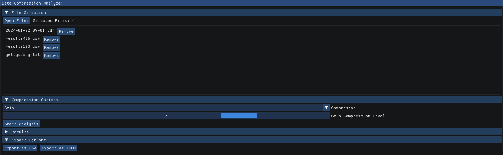
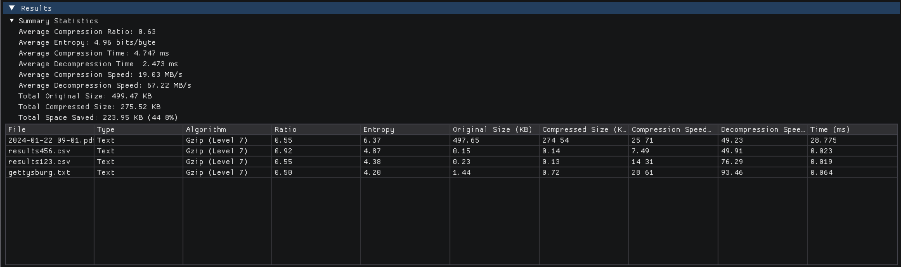

# Data Compression Analyzer

[](https://opensource.org/licenses/MIT)
[](https://isocpp.org/std/the-standard)
[](https://cmake.org/)
[](https://github.com/yourusername/data-compression-analyzer/actions)

A modern GUI application for analyzing and comparing compression algorithms, built with Dear ImGui and C++17.

<br>

## Features

- Support for multiple compression algorithms:
  - Gzip (with configurable compression levels)
  - Archive+Gzip (for compressing multiple files into a single archive)
- Modern GUI built with Dear ImGui
- Comprehensive performance metrics:
  - Compression ratio
  - Compression time
  - Decompression time
  - Memory usage
  - Entropy
  - Throughput
- Multi-file selection and processing
- Export results in CSV or JSON format
- Cross-platform support (Windows, macOS, Linux)

## Requirements

- C++17 or later
- CMake 3.15 or later
- Required libraries (auto-fetched or installed via your package manager):
  - Dear ImGui (auto-fetched)
  - tinyfiledialogs (auto-fetched)
  - nlohmann-json (auto-fetched)
  - zlib (for Gzip compression)
  - GLFW3
  - OpenGL

### macOS (Homebrew) example:
```bash
brew install cmake zlib glfw nlohmann-json
```

## Building and Running

Clone the repository and then build and run the application:

```bash
# Clone the repository
git clone https://github.com/Karan5352/data-compression-analyzer.git
cd data-compression-analyzer

# Build and run (from the project root)
rm -rf build && mkdir build && cd build && cmake .. && make && ./DataCompressionAnalyzer
```

## Usage

1. Launch the application
2. Click "Open Files" to select one or more files for analysis
3. Choose the compression algorithm:
   - Gzip: Compresses individual files
   - Archive+Gzip: Compresses multiple files into a single archive
4. Adjust compression level (1-9) for both algorithms
5. Click "Start Analysis" to begin compression
6. View results in the interactive interface:
   - Summary statistics
   - Detailed results table
7. Export results in CSV or JSON format


## Project Structure

```
.
├── CMakeLists.txt
├── src/
│   ├── main.cpp
│   ├── gui/
│   │   ├── MainWindow.cpp
│   │   └── MainWindow.h
│   ├── compression/
│   │   ├── Compressor.cpp
│   │   ├── Compressor.h
│   │   ├── GzipCompressor.cpp
│   │   ├── GzipCompressor.h
│   │   ├── ArchiveCompressor.cpp
│   │   └── ArchiveCompressor.h
│   └── utils/
│       ├── FileHandler.cpp
│       └── FileHandler.h
├── LICENSE
└── README.md
```

## Features in Detail

### Gzip Compression
- Configurable compression levels (1-9)
- Individual file compression
- Detailed performance metrics (ratio, time, entropy, throughput)

### Archive+Gzip Compression
- Combines multiple files into a single archive
- Uses Gzip compression internally
- Preserves file structure and names
- Configurable compression levels

### Results Analysis
- Compression ratio calculation
- Compression and decompression timing
- Memory usage tracking
- Entropy calculation
- Throughput calculation
- Export functionality for further analysis

## License

This project is licensed under the MIT License - see the LICENSE file for details.
